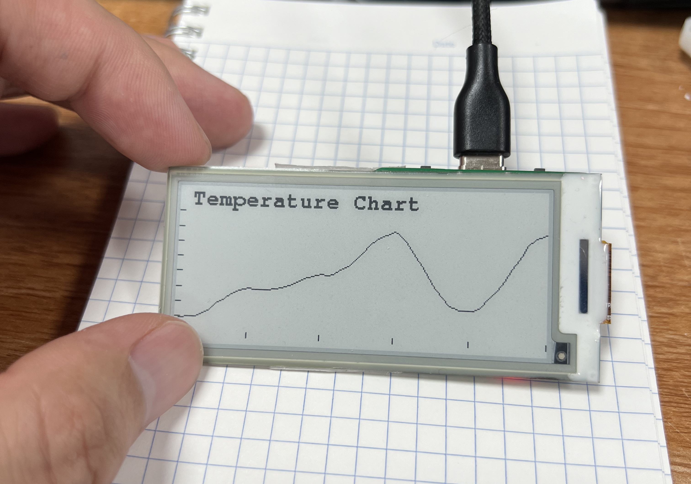
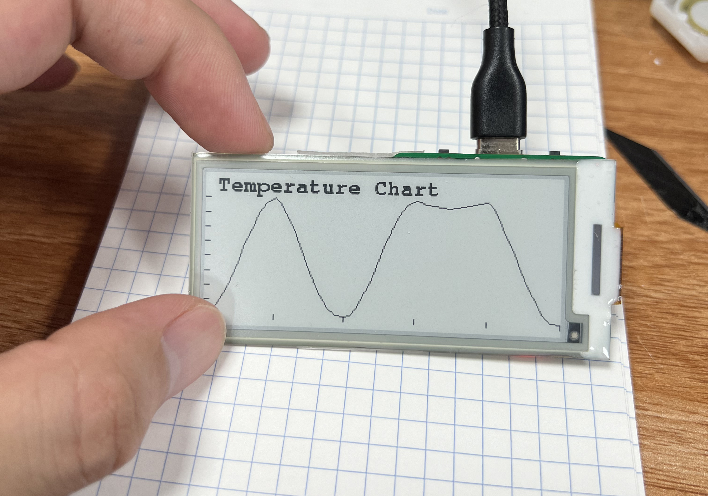
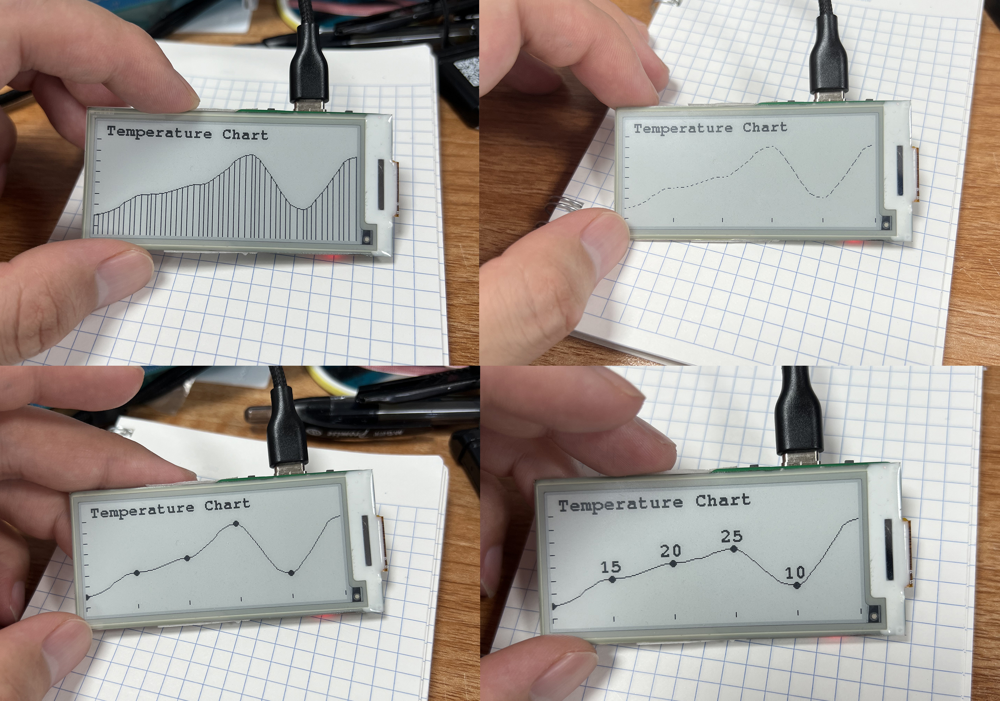
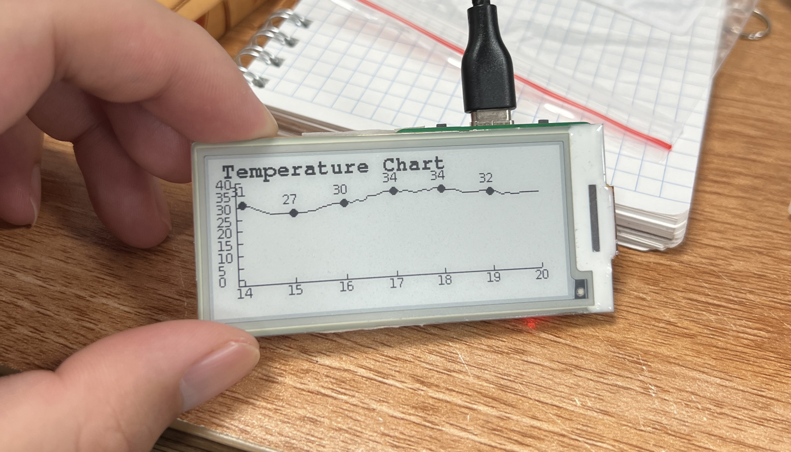

## 在墨水屏上绘制贝塞尔折线图

联网实时显示温度

### 项目简介
此项目是一个简单的绘制贝塞尔折线图的方式，代码仅供参考

- QQ交流群：1051455459

### 使用的硬件
- 一个使用<a target="_blank" href="https://github.com/ZinggJM/GxEPD2">GxEPD2</a>库驱动的墨水屏
- 一个ESP32C3墨水屏开发板（闲鱼搜用户<光芒之轻>有成品售卖）

### 已知bug
- 在前后温度变化差异不大的时候，绘制出来的曲线有点不平整

### 🌟制作不易，感谢支持🌟

